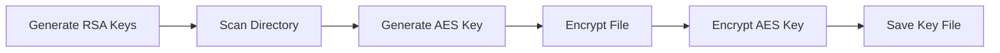
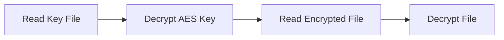

# 🔒 Ayatollah Ransomware

<div align="center">


*A multi-language ransomware simulation for educational purposes*

⚠️ **EDUCATIONAL PURPOSES ONLY** ⚠️

</div>

---

## ⚠️ Disclaimer

> **IMPORTANT:** This code is strictly for **educational and research purposes only**. Creating, distributing, or using ransomware is illegal and unethical. This project helps security researchers, developers, and students understand ransomware mechanics to build better defenses.

## 🌟 Features

- **🔤 Multi-Language Support**
  - Implementations in C, Python, and JavaScript/Node.js
  - Cross-platform compatibility (Python & JavaScript)
  
- **🔐 Advanced Encryption**
  - AES-256 encryption in CBC mode
  - RSA-2048 key wrapping
  - Secure key management system

- **⚡ Performance & Security**
  - Multi-threaded file processing
  - Anti-debugging mechanisms
  - Comprehensive logging system

## 🛠️ How It Works

### 1. Encryption Process


### 2. Decryption Process


## 📦 Installation & Usage

### C Implementation
```bash
# Clone the repository
git clone https://github.com/your-username/Ayatollah-Ransomware.git

# Compile (Windows)
gcc src/c/ayatollah-ransomware.c -o ransomware -lcrypt32

# Run
./ransomware
```

### Python Implementation
```bash
# Install dependencies
pip install cryptography

# Run
python src/python/ayatollah-ransomware.py
```

### JavaScript Implementation
```bash
# Ensure Node.js is installed
node src/javascript/ayatollah-ransomware.js
```

## ⚙️ Configuration

The program uses `config.enc` for settings:

| Setting | Default | Description |
|---------|---------|-------------|
| Target Directory | `C:\test` | Directory to process |
| Log Level | `INFO` | Logging detail level |
| Thread Count | `4` | Number of processing threads |

## 🔍 Technical Details

### Security Measures
- AES-256 encryption for file content
- RSA-2048 for key protection
- Secure random number generation
- Anti-debugging protections

### Performance Features
- Multi-threaded processing
- Buffered I/O operations
- Optimized file handling

## 🤝 Contributing

Contributions are welcome! Please follow these steps:

1. Fork the repository
2. Create your feature branch (`git checkout -b feature/amazing-feature`)
3. Commit your changes (`git commit -m 'Add amazing feature'`)
4. Push to the branch (`git push origin feature/amazing-feature`)
5. Open a Pull Request

## 📄 License

This project is licensed under the MIT License - see the [LICENSE](LICENSE) file for details.

## 🙏 Acknowledgments

- Built for educational and research purposes
- Inspired by cybersecurity research
- Thanks to all contributors

## ⚠️ Final Note

**Remember:** This project is for educational purposes only. Never use this code for malicious purposes. Always practice ethical coding and respect others' digital rights.

---

<div align="center">
Made with ❤️ for cybersecurity education
</div>
